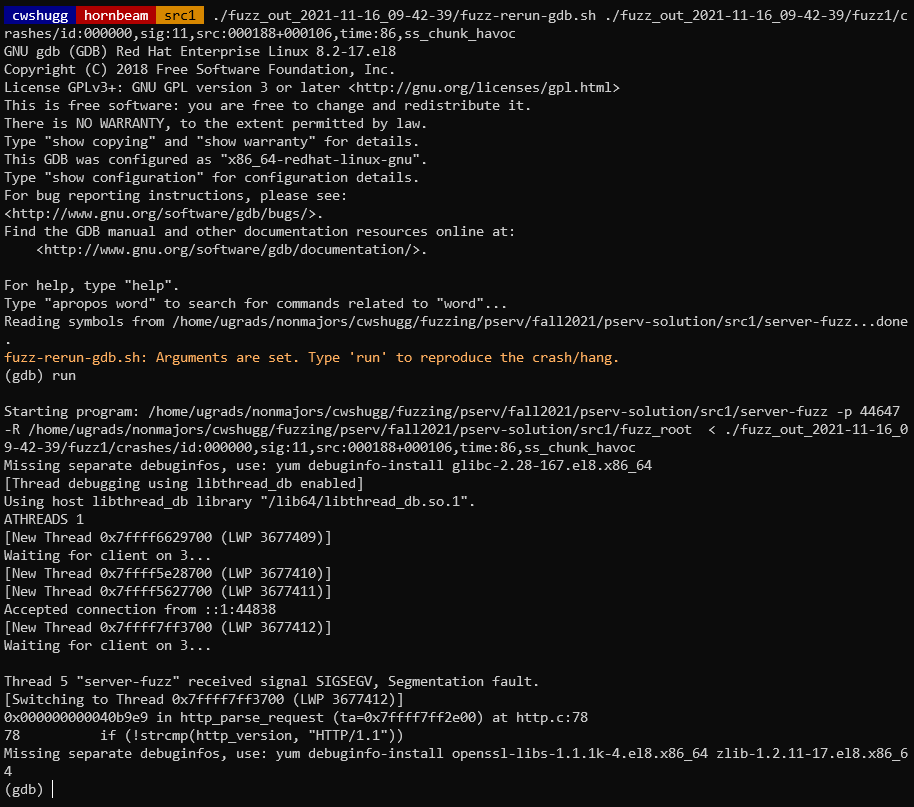

# What do I do after fuzzing?

Once you've completed a fuzzing run, you'll most likely have a few output files whose contents caused your server to crash or hang. (If the fuzzer didn't report any, congratulations! Your server must be pretty robust.) Each of these files contains the input that was sent to your server that caused the issue. From the example shown in `how_to_fuzz.md`, we can see a few of the crash files in `./fuzz_out_2021-11-16_09-42-39/fuzz1/crashes`:


The `LD_PRELOAD` library ("sockstorm") developed for this purpose uses a special file format to represent several connections' data in a single run. Because of this, sending the file straight to your server won't reproduce the exact behavior found by the fuzzer.

(If you'd like to see the details of one of these **comux** files, run `~cs3214/bin/comux -s -i PATH_TO_FILE [-v]` on one to show a summary of how many connections are represented in the file, and what data will be sent to the server.)

Let's look at `./fuzz_out_2021-11-16_09-42-39/fuzz1/crashes/id:000000,sig:11,src:000188+000106,time:86,ss_chunk_havoc`. Based on the file's name (we can see `sig:11`), the fuzzer indicated the server crashed by receiving a SIGSEGV signal (a segmentation fault) when this file's contents were sent to the server.

## Reproducing a Crash or Hang

Once the fuzzer has found a bug in your code, the next logical step would be to reproduce it and debug. This is made easy by the scripts generated inside the fuzzer's output directory (`fuzz-rerun.sh` and `fuzz-rerun-gdb.sh`) Let's say we want to try recreating the supposed SIGSEGV the server received when that file's contents were sent to the server. 

We can take the command straight from the fuzzing summary and modify it to point to the file we're interested in:

```bash
$ ./fuzz_out_2021-11-16_09-42-39/fuzz-rerun.sh ./fuzz_out_2021-11-16_09-42-39/fuzz1/crashes/id:000000,sig:11,src:000188+000106,time:86,ss_chunk_havoc
```


As promised, a segmentation fault occurred! Now, let's try running it in GDB:

```bash
$ ./fuzz_out_2021-11-16_09-42-39/fuzz-rerun-gdb.sh ./fuzz_out_2021-11-16_09-42-39/fuzz1/crashes/id:000000,sig:11,src:000188+000106,time:86,ss_chunk_havoc
```



Again, the SIGSEGV occurred. From here, you can debug in GDB to discover the source of your bug.
