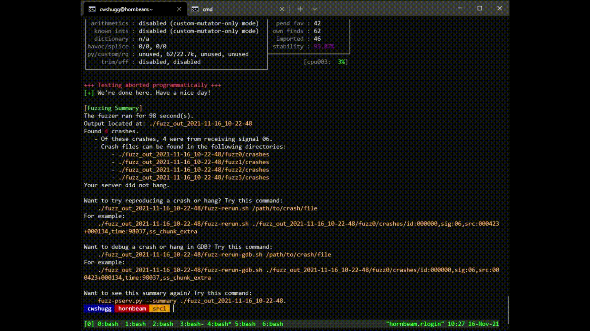

# PServ Fuzzing: Overview

The security of computer systems is extremely important. If vulnerabilities exist in the underlying systems used to complete tasks, exchange important information, communicate with others, etc., a cunning attacker could deal some serious damage.
  
Web servers are one such type of computer system, and since most are directly connected to the internet, they're tested (and often deliberately attacked) every day by thousands of users. How can we be sure a web server can gracefully handle any sort of input?
  
Some may argue that it's impossible to uncover _every_ bug in a system. But, we as computer scientists and computer engineers can use some effective techniques to catch most of them. Fuzzing is one such technique. This "fuzzing interface" allows you to utilize AFL++ (an advanced fuzzer) along with a special `LD_PRELOAD` library (called "sockstorm") to fuzz your pserv implementation. This will help you uncover any bugs in your code that cause your server to crash or hang.

A quick crash-course on how to get started is below. However, many more useful details can be found throughout the documentation.

## Table of Contents

### **Concepts**

- [What is fuzzing?](./sfi_concepts_fuzzing.md)
- [What is AFL++?](./sfi_concepts_afl.md)
- [What is sockstorm?](./sfi_concepts_sockstorm.md)

### **Fuzzing Interface**

- [How do I fuzz my server?](./sfi_how_to_fuzz.md) (`fuzz-pserv.py`)
- [What do I do after fuzzing?](./sfi_after_fuzzing.md)

## Quickstart: Fuzzing your Server

To fuzz your server, do the following:

1.  Run `fuzz-pserv.py --src-dir /path/to/your/pserv/src`
2.  Wait for it to finish (might be a while), or hit Ctrl-C once you're satisfied.
3.  Look at the summary: if any crashes or hangs are found, use these files to debug.

## Quickstart: Reproducing a Crash/Hang

To reproduce a crash found by the fuzzer, do the following:

1.  Choose one of the crash files in the output directory.
2.  Run the following command: `/path/to/fuzzer_output/fuzz-rerun-gdb.sh < /path/to/crash/file`
4.  Investigate! Your server should crash or hang, depending on the file you chose.

